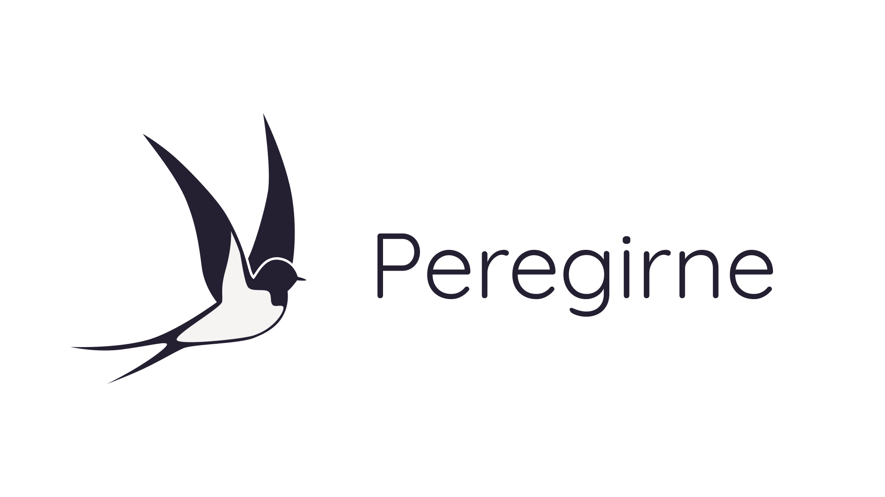
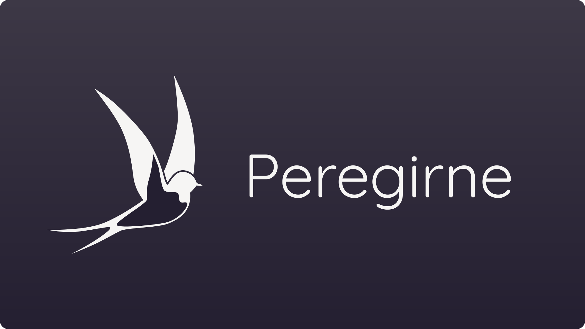
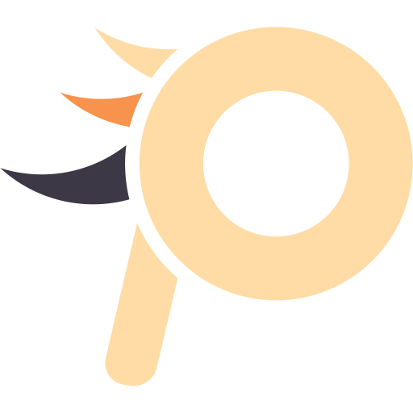
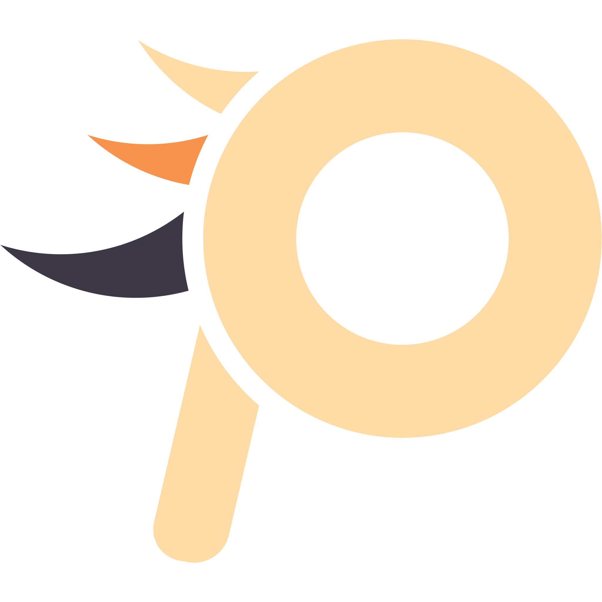

# Graphics

Logo and banner are drawn by [Rechie](https://github.com/RechieKho) and [Mahi Chowdhury](https://github.com/Mahich123). All the graphics are drawn using [inkscape](https://inkscape.org/), a open-source vector program. All graphics are in png format with transparent background expect `dark` version as its background is dark. 

## Banner

## Logos in different dimension 
### Normal
16x16

32x32

64x64

128x128

256x256

512x512

1024x1024

2048x2048

### Dark
16x16

32x32

64x64

128x128

256x256

512x512

1024x1024

2048x2048
